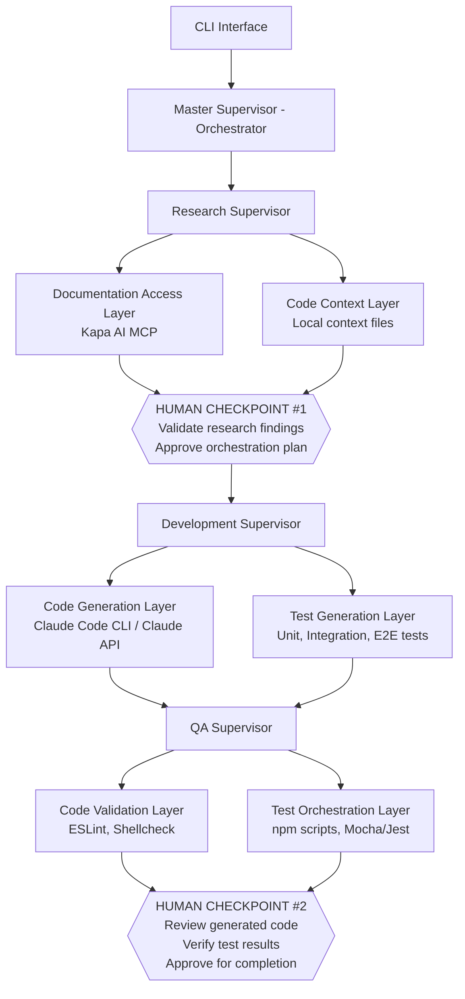

# CHT Hierarchical Multi-Agent System: Technical POC Plan

## Summary

This document outlines a proof-of-concept for a multi-agent system to assist with CHT development workflows. The approach focuses on packaging configurations for agentic use, leveraging existing tools and managed services where possible.

**Current Phase (POC/Demo)**
- Interface: Command-line tool accepting templated issues
- Processing: Layered architecture with human validation checkpoints
- Output: Validated code solutions with test coverage
- Memory: Markdown-based context files for model portability

**Future Vision**
- Integration with GitHub issues (automated triggering via keywords/tags)
- Non-technical partner support through structured templates
- Full CI/CD pipeline integration
- Potential RAG/Vector DB once context is validated

**Target Audience**: Non-technical community members who can template requests, receive research/code/cost analysis, and engage technical partners for implementation.

---

## Goals & Vision

### Primary Goal
Build a **portable context database** of CHT issues, patterns, and resolutions. This knowledge base:
- Survives model upgrades (Claude 5, 6, etc.)
- Works across different agentic frameworks
- Enables faster, more accurate code generation with CHT-specific patterns

### Design Principles

1. **Any Model**: Easily swap between Claude, GPT, Gemini, local models
2. **Plug-and-Play Layers**: Each layer can use off-the-shelf tools (Kapa AI, Claude Code, GitHub CLI, etc.)
3. **Tool Orchestration Over Reinvention**: Coordinate existing CHT tools (cht-conf, cht-toolbox, npm scripts) rather than building custom validation
4. **Minimal Maintenance**: Prefer managed services where possible
5. **Human-in-the-Loop**: Validation checkpoints ensure quality before code generation and commit

---

## System Architecture

**Key Insight**: The "layers" are not custom agents we build from scratch. They are **configuration points** where we plug in the best available tools and services.

---

## Layer Specifications

### Research Supervisor Layers

#### Documentation Access Layer
**Purpose**: Search and retrieve CHT documentation contextually

| Pluggable Options | Notes |
|-------------------|-------|
| **Kapa AI MCP** (default) | Managed service, auto-updated index, free for CHT |
| Custom RAG | Self-hosted alternative if needed |

#### Code Context Layer
**Purpose**: Provide source code understanding and existing patterns to inform development

| Pluggable Options | Notes |
|-------------------|-------|
| **Local context files** (default) | Markdown-based pattern library (our primary deliverable) |
| CHT Specialist Skills | Pre-configured Claude Code skills for CHT |

> **Note**: Tools like DeepWiki can be used separately to auto-generate code documentation (architecture docs, component diagrams) which can then feed into the context layer.

### Development Supervisor Layers

#### Code Generation Layer
**Purpose**: Generate code following CHT patterns and standards

| Pluggable Options | Notes |
|-------------------|-------|
| **Claude Code CLI** | Default option, supports MCP and skills |
| **Claude API** | Default option, direct API access for programmatic control |
| OpenCode | Open-source alternative |
| GitHub CLI (Copilot) | Built-in coding agent |
| Cursor / Windsurf | IDE-based alternatives |

#### Test Generation Layer
**Purpose**: Write tests following CHT testing patterns

| Test Type | Description | Tools |
|-----------|-------------|-------|
| **Unit Tests** | Test individual functions and modules in isolation | Mocha, Jest, cht-conf-test-harness |
| **Integration Tests** | Test component interactions, API endpoints, database operations | Mocha, backend integration suite |
| **E2E Tests** | Simulate real user workflows, validate complete system | WebdriverIO, headless browser |

Based on [CHT Automated Tests documentation](https://docs.communityhealthtoolkit.org/community/contributing/code/core/automated-tests/).

#### Test Environment Layer
**Purpose**: Set up test data and environments

| Pluggable Options | Notes |
|-------------------|-------|
| **cht-conf** | Configuration compilation |
| **cht-toolbox** | Utility functions |
| **cht-datasource** | Data pipeline configs |
| k3d/Docker | Container orchestration for integration tests |

### QA Supervisor Layers

#### Code Validation Layer
**Purpose**: Static analysis and standards compliance

| Pluggable Options | Notes |
|-------------------|-------|
| **ESLint** | JavaScript/TypeScript linting |
| **Shellcheck** | Shell script validation |
| CHT coding standards | Pattern matching against existing code |

#### Test Orchestration Layer
**Purpose**: Run tests and analyze coverage

| Pluggable Options | Notes |
|-------------------|-------|
| **npm scripts** | All test commands via package.json |
| Mocha/Jest/Karma | Test frameworks |
| **nyc** | Coverage analysis |
| WebdriverIO | E2E testing |

---

## Context Database (Primary Deliverable)

The context database is the core asset that makes the system valuable. It's **markdown-based** for portability across models and tools.

> - Directory structure: [Issue #1](https://github.com/medic/cht-agent/issues/1)
> - Schema definition: [Issue #3](https://github.com/medic/cht-agent/issues/3)

---

## Human-in-the-Loop Checkpoints

### Checkpoint #1: Post-Research

**Purpose**: Validate research accuracy before code generation

**What the user sees**:
- Research summary and key findings
- Proposed approach and estimated complexity
- Risk factors identified
- Similar past implementations found

**User actions**: Approve / Request clarification / Modify plan / Reject

### Checkpoint #2: Post-Implementation

**Purpose**: Review code quality before finalizing

**What the user sees**:
- Files generated
- Test results and coverage
- Requirements checklist
- Performance impact analysis

**User actions**: Approve / Request changes / Run additional tests / Reject

**Note**: An "auto-accept" mode (similar to Claude Code) may be offered for experienced users, with appropriate disclaimers.

---

## Stewardship & AI

This system aligns with CHT's broader AI strategy:

- **CHT-Conf Squad**: A related initiative focusing on configuration assistance for non-technical partners. The context database built here will benefit that effort.
- **Flexible Architecture**: The layered, plug-and-play design means individual components can be upgraded or replaced as the AI ecosystem evolves.
- **Community-First**: The goal is enabling non-technical community members to research, request, and understand features without deep technical knowledge.

**Example User Journey**: A program director (like Loukman from West Africa) templates a feature request → receives research findings and cost estimate → engages a technical partner with full context already prepared.

---

## Implementation Phases

### Phase 1: Foundation
- Set up workflow structure (LangGraph)
- Implement Master Supervisor routing
- Integrate basic npm script runner
- Establish context file structure

### Phase 2: Core Layers
- Integrate Kapa AI MCP (Documentation Access)
- Build Code Context Layer (local context files)
- Build Code Validation Layer (ESLint)
- Create Test Generation and Orchestration Layers

### Phase 3: Intelligence
- Context recall and pattern matching
- Intelligent test selection
- Recommendation engine
- Learning feedback loops

### Phase 4: Integration & Polish
- End-to-end workflow testing
- Performance optimization
- Developer experience refinement
- Documentation

---

## Success Metrics

| Metric | Target |
|--------|--------|
| Code validation accuracy | >95% alignment with manual review |
| Context retrieval relevance | >80% precision for similar issues |
| Response time | <60 seconds for standard validations |
| False positive rate | <5% for recommendations |
| Context reuse rate | >60% for similar issues |

---

## Technical Stack

- **Orchestration**: LangChain JS / LangGraph
- **Models**: Claude (Opus for planning, Sonnet for implementation) - swappable
- **Runtime**: Node.js (>=20.11.0)
- **Language**: TypeScript
- **CHT Integration**: npm scripts, ESLint, Mocha/Jest/Karma, nyc, cht-conf, WebdriverIO
