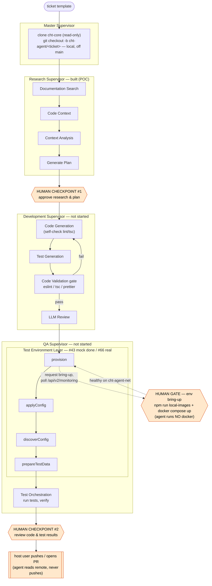

# Test Environment Layer — Recommendation Document

**Issues:** [#16](https://github.com/medic/cht-agent/issues/16) (discovery), [#66](https://github.com/medic/cht-agent/issues/66) (implementation), [#43](https://github.com/medic/cht-agent/issues/43) (mock tests)

---

## Summary

The Test Environment Layer provides the cht-agent with a **live, configured, data-populated CHT instance that it can manipulate and test against**. It is deterministic orchestration — no LLM lives in this layer.

The decisive architectural fact: **the cht-agent runs inside a container.** The Test Environment Layer does not spin CHT up *inside* the agent (no docker-in-docker). Instead it brings CHT services up on the **same Docker network** as the cht-agent container, sharing the **same cht-core code volume**. The agent then reaches into that shared, networked, volume-mounted environment to apply generated code, seed data, and run tests in place.

> **The contract:** *"I give you a healthy CHT instance on your network, wired to the same code volume you're editing, with the right config and test data. Code you write into the volume reaches the running env on a (human-gated) rebuild. You tell me when to reset, rebuild, or tear down."*

The "walk into a secure room and bounce off the walls until tests pass" behaviour is **the containerized cht-agent itself** (its QA Supervisor) acting against this environment — it is *not* a new LLM agent introduced by this layer. This layer builds the room and hands over the keys; the agent does the bouncing.

### Decisions captured (from design review, 2026-06-05)

| Decision | Choice | Consequence |
|----------|--------|-------------|
| **Layer identity** | Deterministic provisioning service consumed by the *already-containerized* cht-agent | No LLM in this layer. Iteration intelligence lives in the QA Supervisor, which runs in the cht-agent container. |
| **Code iteration model** | **Model A — rebuild-on-change** | Agent edits the working copy → human-gated `local-images` rebuild → restart. cht-core has **no in-container hot-reload** today, so the live-mount "Model B" is deferred. No spike for this build. |
| **PR-review mode** | **Design now, build later** | Interfaces and flow are specified here; implementation lands after the internal-pipeline path. |
| **Sandbox** | **PoC 5-layer git/credential sandbox**, around the cht-agent container | Claude runs autonomous loops with **read-only** remote access (public repos), **no write credentials, no Docker socket**, and a hard push block — only the host user pushes. |

---

## Architectural Placement

The layer sits under the **QA Supervisor**, as the first step of QA work:

```
QA Supervisor  (runs inside the cht-agent container)
├── Test Environment Layer     ← THIS: build/start/seed/health, wire network + volume
└── Test Orchestration Layer    ← run tests, manual QA, verification, pass/fail (#18)
```

The Development Supervisor's **Test Generation Layer** *writes* test code. This layer writes *no code* — it provisions the infrastructure those tests run on.

> **Precondition — who provides cht-core:** the cht-core working copy (a standing local clone, modified in place by the Development Supervisor's Code Generation Layer in the internal pipeline) is an **input** to this layer. The Test Environment Layer never clones or edits code — it builds, runs, and seeds the copy it's handed. Only standalone/PR-review mode performs a checkout, since no Dev Supervisor ran first.
>
> | Mode | Who provides the working copy | This layer's job |
> |------|------------------------------|------------------|
> | Internal pipeline | Dev Supervisor (clones + writes generated code in place) | build + run + seed the already-present copy |
> | Standalone / PR-review | The CLI invocation (`--cht-core-path` points at it, or `--pr` checks a branch out) | checkout *only in PR mode*, then build + run + seed |
>
> *Status:* this is design intent. The Development Supervisor is not yet started, and no clone step / `CHT_CORE_PATH` contract exists in code today — the working copy's origin is a shared assumption across the layer recommendations, not a built handoff.

### The container topology

```
                         shared docker network: cht-agent-net
   ┌───────────────────────────────────────────────────────────────────────┐
   │                                                                         │
   │   ┌────────────────────────┐         ┌──────────────────────────────┐  │
   │   │   cht-agent container   │         │      CHT test environment     │  │
   │   │  (LangGraph, Claude,    │         │  (brought up by this layer)  │  │
   │   │   QA Supervisor)        │         │                              │  │
   │   │                         │  HTTP   │  ┌────────┐  ┌────────────┐  │  │
   │   │  • edits cht-core code  │ ──────▶ │  │ nginx  │  │  haproxy   │  │  │
   │   │  • runs cht-conf        │ /api/.. │  └────────┘  └─────┬──────┘  │  │
   │   │  • runs npm test        │ ◀────── │  ┌────────┐  ┌─────▼──────┐  │  │
   │   │  • 5-layer git sandbox  │         │  │  api   │  │  sentinel  │  │  │
   │   │                         │         │  └───┬────┘  └─────┬──────┘  │  │
   │   └───────────┬─────────────┘         │      └──── couchdb ┘         │  │
   │               │                       └──────────────┬───────────────┘  │
   │               │   shared volume: cht-core working copy (rw)              │
   │               └──────────────────────────────────────┘                  │
   │   (Model A: agent edits the working copy; a rebuild via local-images     │
   │    bakes new images that the CHT env runs — no live source mount)        │
   └───────────────────────────────────────────────────────────────────────┘
                                      ▲
                          host operator (control plane):
                  image builds (local-images), phase approvals,
                       git remotes, merges  — never DinD
```

**Why this shape:**
- **No docker-in-docker, and no Docker socket.** The cht-agent does not run Docker at all. The **host operator** brings services up (human-gated). A mounted host Docker socket was considered and **rejected** — it grants host-root (see [Sandbox Model](#sandbox-model-adapted-from-the-poc) and the resolved note in [Open Questions](#open-questions)).
- **Shared network** means the agent reaches CHT at a stable hostname (e.g. `https://nginx` / `https://haproxy`) with no port juggling.
- **Shared code volume** (host ↔ cht-agent container) is the working copy the agent edits and the host builds from. Under **Model A** (chosen), code changes reach the running CHT env via a rebuild (`local-images`), *not* a live mount into api/sentinel. Live-mount hot-reload (Model B) is a deferred optimization — see [Code-iteration model](#code-iteration-model-the-re-test-problem).

### The compose artifacts live in the target repo, not in cht-agent

This layer **orchestrates the target repo's own launch tooling** rather than shipping its own compose stack (consistent with "Tool Orchestration Over Reinvention"). cht-core already provides everything needed:

| Target-repo asset | Role in this layer |
|-------------------|--------------------|
| [`scripts/docker-helper/cht-docker-compose.sh`](https://github.com/medic/cht-core/blob/master/scripts/docker-helper/cht-docker-compose.sh) | **Published-version bring-up.** Downloads `cht-core.yml` / `cht-couchdb.yml` / `upgrade-service.yml`, generates a `.env` (sets `medic/password`, `CHT_NETWORK`, auto-incremented ports), and offers `start` / `stop` / `destroy`. Used for the PR-review path and any "known good version" environment. |
| `npm run local-images` + generated `local-build/` compose | **Local-code bring-up.** Builds branch-tagged images from the working copy so the agent tests *its own* changes. Used for the internal pipeline. |

cht-agent contributes only a **thin compose override** that joins the running stack to `cht-agent-net` so the agent container can reach the services. The override layers on top of the target repo's compose files via `docker compose -f <target> -f <override>`. The `CHT_NETWORK` variable the helper already exposes is the seam we attach to. (A future Model B override would additionally mount source into api/sentinel for hot-reload.)

---

## Internal Pipeline Flow (where this layer fits, and where humans gate)

The cht-agent runs on a ticket template. The dockerized agent clones cht-core (read-only — public repo), branches off `main` locally, runs the agentic layers to complete the ticket, and invokes this layer when it needs a live environment. Docker and remote `git push` are **human-only**.



**Human-involvement points (orange):**

1. **Bootstrap clone** — read-only. The agent (or operator) clones the public cht-core and makes a **local** branch off `main`; it never pushes.
2. **HUMAN CHECKPOINT #1** — after Research: approve findings + plan before any code is generated.
3. **HUMAN GATE — env bring-up** — inside this layer's `provision`: the agent *requests* the environment and polls `/api/v2/monitoring`; the **human** runs `local-images` + `docker compose up` (the agent runs no Docker — a mounted socket would be host-root). CouchDB-tier resets are the exception — the agent does those over the CouchDB HTTP API.
4. **HUMAN CHECKPOINT #2** — after QA: review generated code + test results.
5. **Push** — only the host user pushes / opens the PR; the agent has read-only remote access and a hard push block.

---

## Three Responsibilities

### 1. Environment Lifecycle

#### Bootstrap sequence

```
1. Choose bring-up path →  local code  → npm run local-images           (host / human-gated)
                           published    → scripts/docker-helper/cht-docker-compose.sh
2. Start services       →  docker compose -f <target compose> -f <cht-agent override> up -d
                           (override joins cht-agent-net so the agent can reach the services)
3. Wait for readiness    →  poll /api/v2/monitoring         (exponential backoff)
4. Upload config        →  cht-conf compile/upload-app-settings
5. Seed test data       →  see Responsibility #3
6. Signal ready         →  write environment handle to a file (URL, auth, network, config)
```

#### Code-iteration model (the re-test problem)

**cht-core ships no in-container hot-reload.** The official `api` image (`node:22-alpine`, `NODE_ENV=production`, entrypoint `docker-entrypoint.sh main`) runs **pre-built artifacts** copied in at build time; it does not watch source. `cht-docker-compose.sh` runs *published* images (no local source mounted at all). `npm run local-images` produces *baked* images. **None of the three reflect a live source edit out of the box** — changing api/sentinel code otherwise requires a rebuild.

cht-core's reload story exists only as a **host-side dev workflow**: `npm run dev-api` / `npm run dev-sentinel` run `api run-watch` / `sentinel run-watch` (nodemon-style) as Node processes on the host, pointed at a CouchDB that may be in Docker.

### Model A — rebuild-on-change (CHOSEN for this build)

The agent edits the working copy, then triggers `npm run local-images` + restart, with the heavy build behind a **human-gated phase**. Every code change to any service goes through a rebuild. Guaranteed to work, no custom plumbing, ~3–5 min/iteration. This is the PoC model.

```
edit code (any service)  →  signal build-request  →  [HUMAN GATE]  →
  npm run local-images (host)  →  docker compose up -d (restart)  →  re-run tests
```

The reset tiers below make this tolerable: most iteration is *config/data* changes (no rebuild), and only *code* changes pay the rebuild cost.

### Model B — containerized `run-watch` (DEFERRED optimization)

cht-core has no in-container hot-reload, but its host-side `run-watch` workflow could be containerized: run `api run-watch` / `sentinel run-watch` in a sidecar container with the working copy + `node_modules` mounted, on the shared network, pointed at the containerized CouchDB (i.e. `dev-api`/`dev-sentinel`, containerized). That would give second-scale backend reloads. It is **not part of this build** — it carries unproven plumbing risk (mounted `node_modules`, watcher-in-container, shared CouchDB) and would need a dedicated spike first. Revisit once Model A is working end-to-end.

#### Readiness strategy

Poll `GET /api/v2/monitoring` with exponential backoff until healthy (the pattern used by cht-conf's e2e utilities, [`cht-docker-utils.js`](https://github.com/medic/cht-conf/blob/main/test/e2e/cht-docker-utils.js)). This mirrors the PoC's `health-check.sh --wait` (60 retries × 5s).

```typescript
const waitForReady = async (url: string, maxWaitMs = 120_000): Promise<void> => {
  const start = Date.now();
  let delay = 2_000;
  while (Date.now() - start < maxWaitMs) {
    try { if ((await fetch(`${url}/api/v2/monitoring`)).ok) return; } catch { /* not up */ }
    await sleep(delay);
    delay = Math.min(delay * 1.5, 15_000);
  }
  throw new Error(`CHT did not become ready within ${maxWaitMs}ms`);
};
```

Supplementary: `docker ps` confirms all expected containers are up; `GET /api/v1/settings` confirms the API is *serving config*, not merely accepting TCP.

#### Phase gates (ported from the PoC)

Resource-heavy or human-only steps (image builds, webapp rebuilds, first bring-up) are guarded by a `phase-gate.sh`-style mechanism: `check` / `wait` / `approve` / `status` backed by a `.current-phase` file. The agent **block-waits** on a gate it needs; the human **approves** after verifying. This is exactly how the PoC prevented agents from racing ahead of services that didn't exist yet.

#### Reset mechanism (three tiers)

| Strategy | Speed | Isolation | When |
|----------|-------|-----------|------|
| CouchDB wipe + reseed | ~10s | Good | Between test cases in a session; after config/data changes |
| Container restart | ~30–60s | Better | Between suites / after config change |
| Full teardown + rebuild | ~3–5min | Complete | Between tickets / **after any code change** (Model A) |

Default: **CouchDB wipe + reseed** for config/data iterations. Under Model A, **any code change to api/sentinel/webapp requires the full rebuild tier** (human-gated). This is the cost Model B would later remove for backend code.

#### Teardown

`docker compose down -v` (the `-v` clears volumes for a clean slate). Always run on completion or failure to avoid orphaned containers.

### 2. Config Discovery

Connect to the running instance and learn its deployed configuration so generated test data is *valid for this deployment*.

| Endpoint | Data |
|----------|------|
| `GET /api/v1/settings` | `contact_types` (hierarchy), `roles`, `permissions`, `transitions`, task/target config |
| `GET /api/v1/forms` | installed form list |
| `GET /api/v1/forms/{id}.xml` | individual form definitions |
| CouchDB `_all_docs` | existing documents for reference |

Config-driven generation is what lets the layer work against *any* deployment instead of a hardcoded hierarchy — mismatched data produces false test failures.

### 3. Test Data Preparation

Generate and upload data that conforms to the discovered config.

| Tool | Purpose | Invocation |
|------|---------|------------|
| `cht-conf` `csv-to-docs` + `upload-docs` | CSV → JSON docs → instance | child_process |
| `cht-conf` `create-users` | user accounts from CSV | child_process |
| `cht-conf` `compile-app-settings` `upload-app-settings` | compile + upload config | child_process |
| CHT API | direct doc creation | `POST /api/v1/people`, `/places` |
| CouchDB API | bulk ops | `POST /medic/_bulk_docs` |
| `cht-datasource` | typed read/verify (remote adapter, CHT 4.18.0+) | `@medic/cht-datasource` |
| `cht-conf-test-harness` | config-level tests (tasks/targets/contact-summary/forms) **without** a full instance | in-process |

**Data strategy:** read config → build a valid hierarchy (places per level, people assigned) → create users with valid roles → generate reports matching installed forms → upload. Keep it **minimal but complete**.

**Harness shortcut:** when the Test Generation agent produced only config-level tests (task logic, target math, contact summaries), `cht-conf-test-harness` runs them with no Docker at all. The layer should detect this and skip full bring-up.

---

## Tool Capabilities Matrix

| Tool | Lifecycle | Config Discovery | Data Prep | Notes |
|------|:--------:|:---------------:|:---------:|-------|
| `npm run local-images` | build baked images | — | — | webapp/nginx; human-gated |
| `docker compose` | start/stop/reset, network + volume wiring | — | — | sibling containers, not DinD |
| CHT API `/api/v1/*`, `/api/v2/monitoring` | health/readiness | settings, forms | create contacts/reports | primary programmatic interface |
| `cht-conf` | — | — | upload config, users, docs | child_process |
| `cht-conf-test-harness` | simulates CHT (no Docker) | — | embedded data | config-level tests only |
| `cht-toolbox` | — | — | replicate docs between instances | seed from a real env ([chtoolbox](https://github.com/jkuester/chtoolbox)) |
| `cht-datasource` | — | — | read/verify | typed API, 4.18.0+ |
| CouchDB API | — | — | bulk seed/cleanup | direct DB access |

---

## Interfaces

### CLI (independent invocation)

Follows the `npm run research <ticket>` pattern so the layer is callable standalone — for manual QA, overnight refactors, and (later) PR review.

```bash
# Full setup against a code volume the agent shares:
npm run test-env -- --cht-core-path /workspace/cht-core

# Use a published image instead of building from source:
npm run test-env -- --version 4.18.0

# Lifecycle:
npm run test-env -- --reset      # restart + reseed
npm run test-env -- --teardown   # down -v

# PR review (designed now, built later):
npm run test-env -- --pr <branch|url>   # checkout, provision, run existing suite, write report
```

The handle (URL, auth, network name, discovered config) is written to a file (e.g. `.test-env/handle.json`) so the QA Supervisor — or a later inference step — can read it. This is the "**outputs written to a file, called for inference later**" 

### LangGraph node

```typescript
interface TestEnvironmentState {
  chtCorePath?: string;       // shared code volume path
  version?: string;           // published image instead of source build
  network?: string;           // docker network to join (defaults to cht-agent's)
  environmentUrl?: string;    // output: e.g. https://nginx
  environmentAuth?: string;   // output
  config?: DiscoveredConfig;  // output: contact_types, roles, forms, transitions
  handlePath?: string;        // output: path to the written handle file
  status: 'idle' | 'building' | 'starting' | 'seeding' | 'ready' | 'error' | 'teardown';
  error?: string;
}
```

These types belong in `src/types/index.ts` alongside the existing `ResearchState`.

---

## PR-Review Mode (designed now, built later)

The independent first-pass reviewer @Hareet described: *"if we believe the user did not run tests, or an inference pass would help, launch this part of the cht-agent."*

**Flow (to implement after the internal-pipeline path):**
1. `--pr <branch|url>` → checkout the PR branch into the shared code volume (read-only sandbox; the agent cannot push — see Sandbox).
2. Provision the environment against that code (Model A rebuild applies).
3. Run the **existing** test suite the PR *should* have run (`npm run unit-*`, integration where infra allows).
4. Write results + diff context to the handle file.
5. *(optional, flagged)* Hand the results to an inference step in the QA Supervisor for a first-pass review comment.

This layer's responsibility stops at **provision + run-existing-tests + write-report**. The inference/review judgement is the QA Supervisor's, consistent with the scope boundary.

---

## Sandbox Model (adapted from the PoC)

Because Claude runs autonomous loops *inside the cht-agent container*, the container is hardened so it can **read** public repos but **never push or reach the host**. cht-core and the cht-agent repos are public, so clone/fetch (read) is allowed; write access to any remote is hard-blocked, and **only the host user pushes**. Five independent layers (any one sufficient; all active):

1. **No write credentials, no Docker socket.** No SSH keys, no `~/.gitconfig`, no `GH_TOKEN`, and **no host Docker socket** — a mounted socket grants host-root (launch any image, bind-mount `/`), so it is rejected. The agent never runs Docker; env bring-up is human-gated.
2. **Push hard-blocked at system git config** (baked in the image) — `pushInsteadOf` rewrites GitHub *push* URLs to `error://` and `push.default=nothing`; requires root to change. **Fetch/clone stay allowed** for public repos.
3. **No way to authenticate a push** — even past layer 2, there are no tokens/keys in the container, so no remote write can succeed.
4. **Pre-push hook + dummy identity** — installed on container start as defense in depth.
5. **Agent instructions** (`CLAUDE.md`) — "reading remotes is fine; never `git push` or change a remote; the host user owns pushing; no external network except CHT services on `cht-agent-net`."

`.claude/settings.json` allow/deny-lists tools — allow: `npm`, read-only/local `git` (`clone`/`fetch`/`pull`/branch/commit), `curl`, `cht-conf`; deny: `git push`, `git remote set-url`, `ssh`, `rm -rf`, and Docker. The PoC's **ralph loop** (command-on-repeat with a hard timeout, because Claude stalls indefinitely on rate limits) and **file-based signals** (`stop`/`pause`/`build-request`) are reused for autonomous operation.

---

## Industry Context

Production multi-agent dev systems universally separate environment setup from agent logic — environment is a *service the agent consumes*, not a step it performs:

| System | Approach |
|--------|----------|
| SWE-Agent | SWE-ReX runtime abstraction (shared, Docker-based) |
| Devin | pre-configured Devbox sandbox |
| OpenHands | Workspace SDK (pluggable backends) |
| Amazon Q | Devfile declarations |
| MetaGPT / ChatDev | implicit (assumed to exist) |

Our design matches this: the Test Environment Layer is the service; the QA Supervisor is the consumer.

---

## Implementation Plan (the step-by-step for #66 + #43)

> Detailed in the working plan; summarized here so the doc is self-contained. The mock-mode agent and its tests are **#43**; all real orchestration is **#66**.

- **#43 (DONE) — Mock-mode agent + tests.** (Agent + spec land together, per repo convention.)
  - Types in `src/types/index.ts`: `DiscoveredConfig` (+ `ContactTypeConfig`, `RoleConfig`, `TransitionConfig`), `ProvisionOptions`, `EnvironmentHandle`, `TestDataResult`, `ResetTier`.
  - `src/agents/test-environment-agent.ts` with **mock mode** mirroring the other agents — six methods (`provision`, `applyConfig`, `discoverConfig`, `prepareTestData`, `reset`, `teardown`): mock paths return cloned fixtures, real mode throws "not yet implemented".
  - `src/agents/test-environment-agent.mock-data.ts` fixtures; `test/agents/test-environment-agent.spec.ts`.
  - **Not in #43:** real Docker, the CLI, the LangGraph node, `TestEnvironmentState`.
- **#66 — real orchestration** (fills in each method's real path):
  - **Phase 1 — Lifecycle (Model A).** Build + run + seed the **already-present** cht-core working copy (build via `local-images`; for standalone/published use `cht-docker-compose.sh`) + thin compose override to join `cht-agent-net`. Readiness polling (`/api/v2/monitoring`), phase gates for the human-gated rebuild, three-tier reset, teardown. **No clone, no hot-reload, no spike** — the working copy is an input (see Precondition).
  - **Phase 2 — Config discovery.** Real `/api/v1/settings` + `/forms` parsing into `DiscoveredConfig`.
  - **Phase 3 — Test data prep.** cht-conf child_process wrappers, config-driven generation, harness shortcut detection.
  - **Phase 4 — Handle + LangGraph node + CLI.** Add `TestEnvironmentState`; write the handle file; wire the node into the QA Supervisor graph; add the `npm run test-env` CLI (`src/cli/test-env.ts`).
- **#66+ (later) — PR-review mode & sandbox container.** `--pr` flow; port the PoC `.devcontainer` security layers.
- **Deferred — Model B hot-reload.** Containerize cht-core's `run-watch` (needs its own spike). Only after Model A is working end-to-end.

---

## Notes

1. **Who runs `docker`? — RESOLVED: human-gated.** The agent never runs Docker. A mounted host Docker socket grants host-root (launch any image, bind-mount `/`), so it is **rejected on security grounds**. The human brings the env up/down (`local-images`, `compose up/down`); the agent requests bring-up and polls `/api/v2/monitoring`. CouchDB-tier reset is the one exception — done by the agent over the CouchDB HTTP API, no Docker.
2. **Model B feasibility (deferred).** Whether cht-core's `run-watch` survives containerization with mounted `node_modules` + shared CouchDB. Its own spike, only after Model A works.
3. **Resource constraints.** `local-images` builds need ~8GB RAM / 50GB disk / 4 cores. Behaviour when unavailable?
4. **Image caching.** Cache baked images per git SHA to skip webapp rebuilds when unchanged.
5. **Parallel environments.** Multiple instances (distinct networks) for concurrent tickets from the Master Supervisor.
6. **Harness-vs-Docker heuristic.** How the layer decides `cht-conf-test-harness` is sufficient based on what the Test Generation agent produced.
